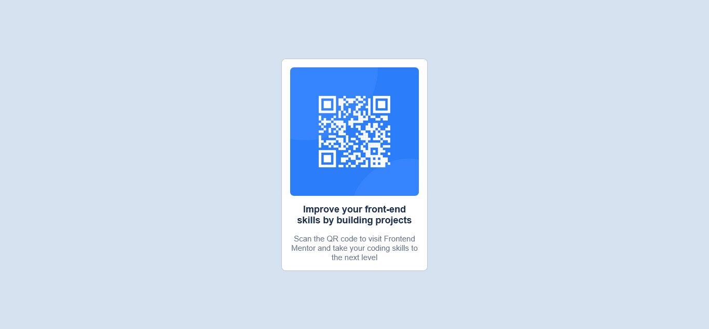

# Frontend Mentor - QR code component solution

This is a solution to the [QR code component challenge on Frontend Mentor](https://www.frontendmentor.io/challenges/qr-code-component-iux_sIO_H). Frontend Mentor challenges help you improve your coding skills by building realistic projects.

## Table of contents

- [Overview](#overview)
  - [Screenshot](#screenshot)
  - [Links](#links)
- [My process](#my-process)
  - [Built with](#built-with)
  - [What I learned](#what-i-learned)
  - [Continued development](#continued-development)
  - [Useful resources](#useful-resources)
- [Author](#author)
- [Acknowledgments](#acknowledgments)

## Overview

### Screenshot



### Links

- [Solution URL](https://github.com/Ekott2006/frontend-mentor-qr-code-component)
- [Live Site URL](https://ekott2006.github.io/frontend-mentor-qr-code-component/)

## My process

### Built with

- Semantic HTML5 markup
- CSS custom properties
- CSS Grid

### What I learned

Using  `place-items` to center element both horizontally and vertically

```css
body {
  display: grid;
  place-items: center;
}
```

### Continued development

- Placing the Footer

### Useful resources

- [Example resource 1](https://css-tricks.com/snippets/css/complete-guide-grid/) - This helped me for master CSS Grid very easily. I really liked this pattern and will use it going forward.

## Author

- Website - [Nsikak Ekott](https://portfolio-site-sage-three.vercel.app/)
- Frontend Mentor - [@Ekott2006](https://www.frontendmentor.io/profile/Ekott2006)

## Acknowledgments

- [Claude AI](https://claude.ai)
- [ChatGPT](chatgpt.com)